# Gulzeesh T‑Shirt Store (React + Vite)

A client‑side t‑shirt catalogue with search, filters, cart, and a playful checkout flow. Built with React + TypeScript + Vite and deployed on Netlify.

## Live Demo
```
https://ctruh-assigment.netlify.app/
```

## Screenshots
Desktop
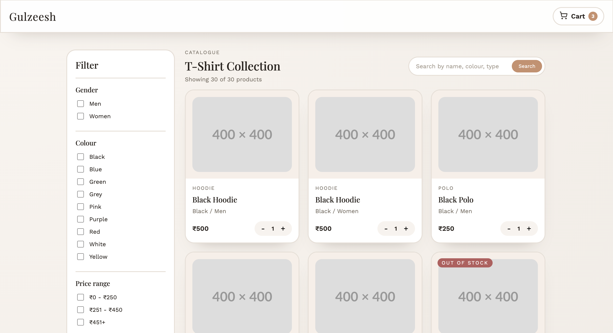
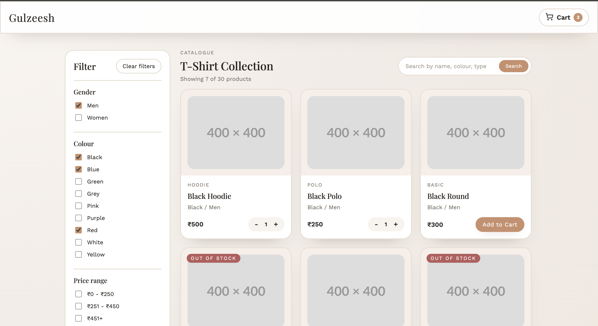
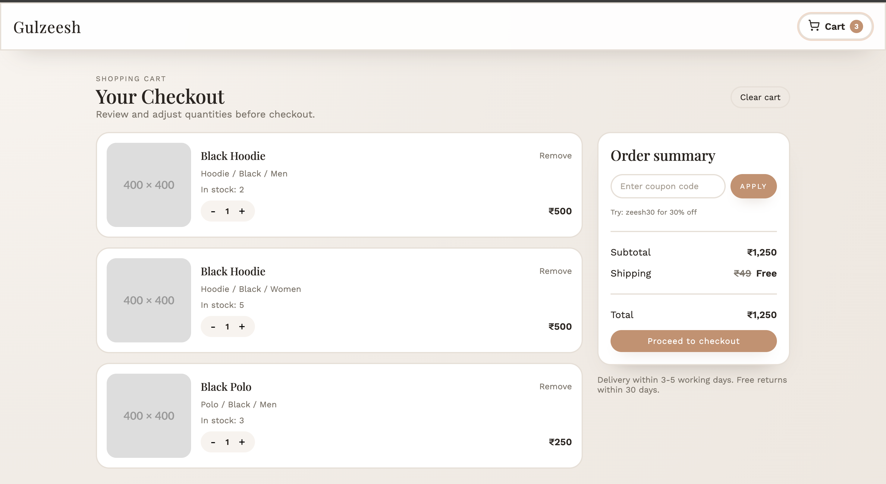
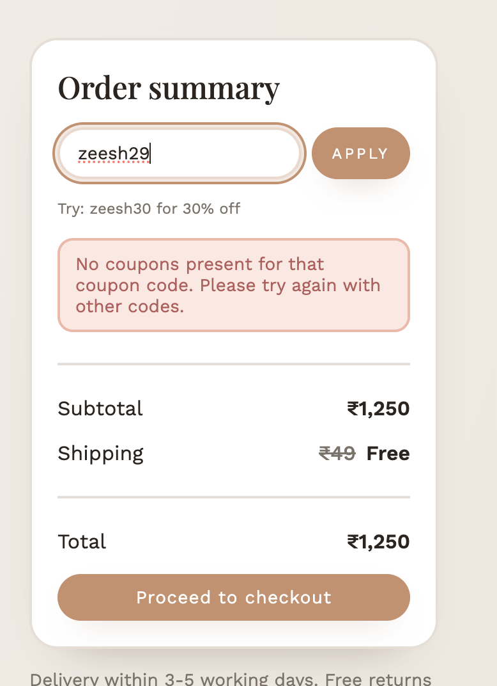
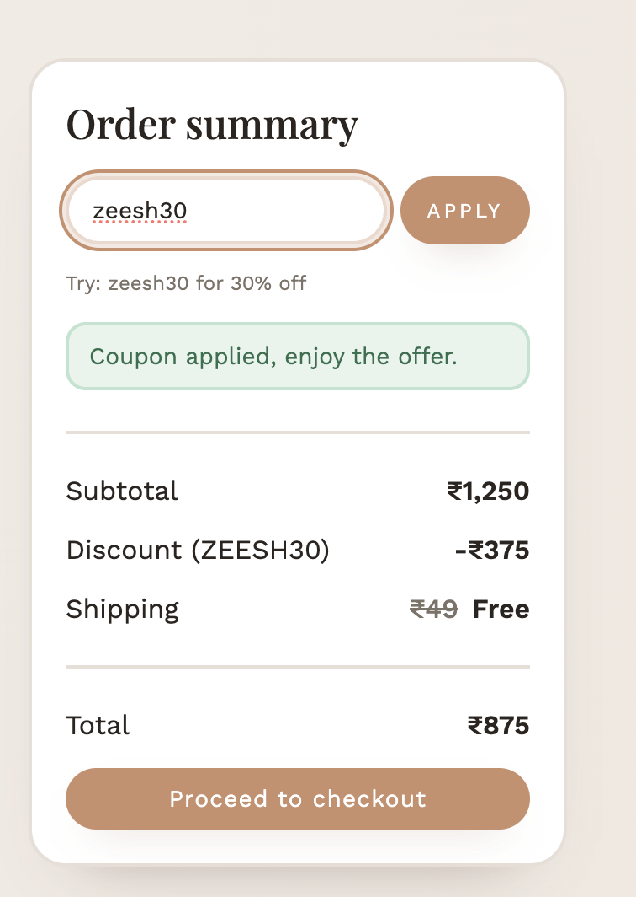
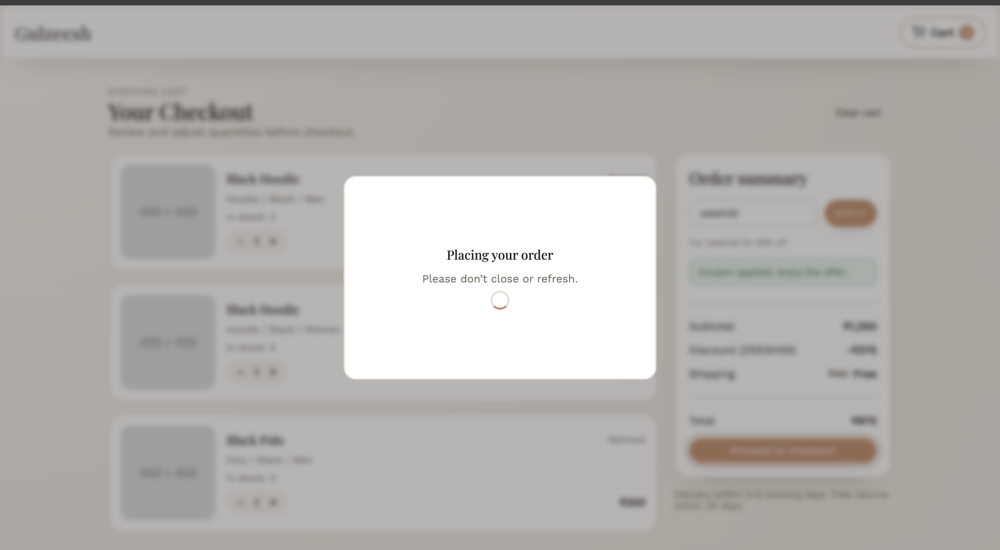
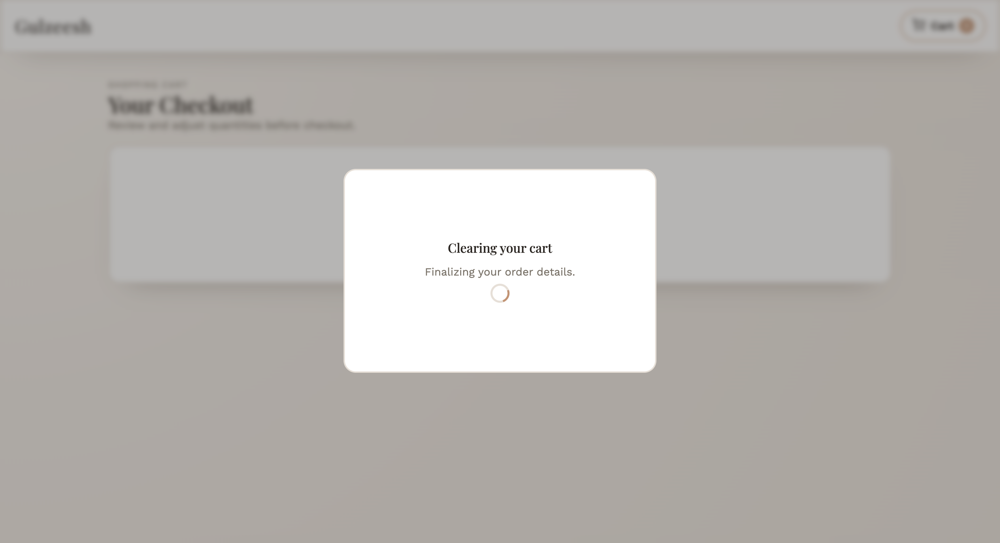
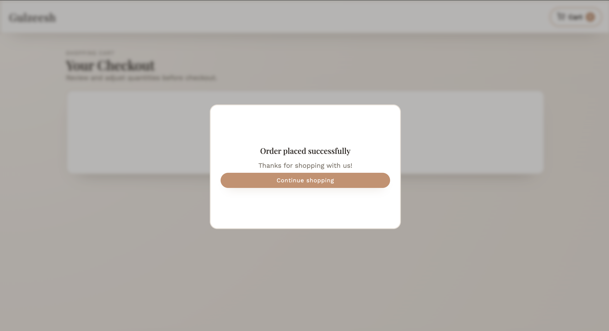

Mobile
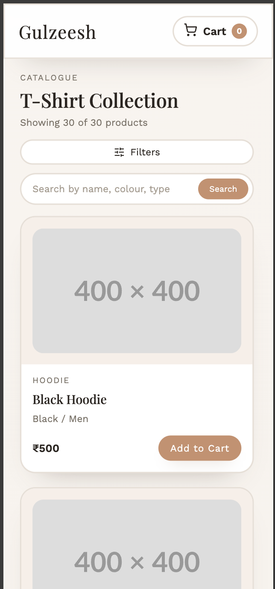
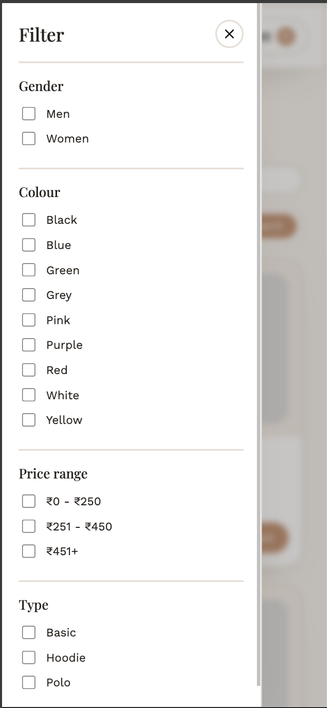
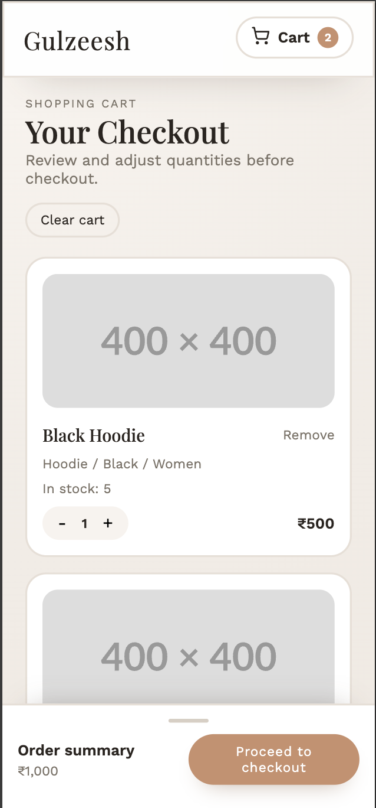
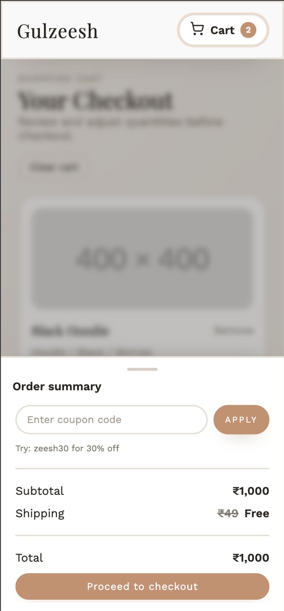

## Features
- Product listing with image, name, price, and inventory checks
- Search by free text (name / colour / type)
- Filters by gender, colour, price range, and type
- Cart with quantity controls, removal, and total calculation
- Coupon support (`zeesh30` = 30% off)
- Shipping rules (free over ₹499, strike‑through fee display)
- Mobile filter drawer (portal) and mobile cart bottom sheet
- Checkout modal with embedded video flow and success state
- Cart persistence via encrypted local storage

## Tech Stack
- React + TypeScript
- Vite
- React Router
- React Toastify
- Lucide Icons

## Getting Started

Install dependencies:
```bash
yarn
```

Run locally:
```bash
yarn dev
```

Build:
```bash
yarn build
```

Preview production build:
```bash
yarn preview
```

## Data Source
Products are fetched from:
```
https://my-json-server.typicode.com/Gulzeesh/demo/products
```

## Routing (Netlify)
This is an SPA. To enable direct navigation to routes like `/cart`, the following redirect is included:
```
public/_redirects
/*    /index.html   200
```

## Project Structure
```
src/
  api/
  components/
  constants/
  context/
  hooks/
  pages/
  styles/
  utils/
```

## Notes
- All features are client‑side only (no backend).
- Filters and search are URL‑synced (persist on refresh).
- Cart is stored locally and encrypted.

---
Made for the Gulzeesh assignment.
